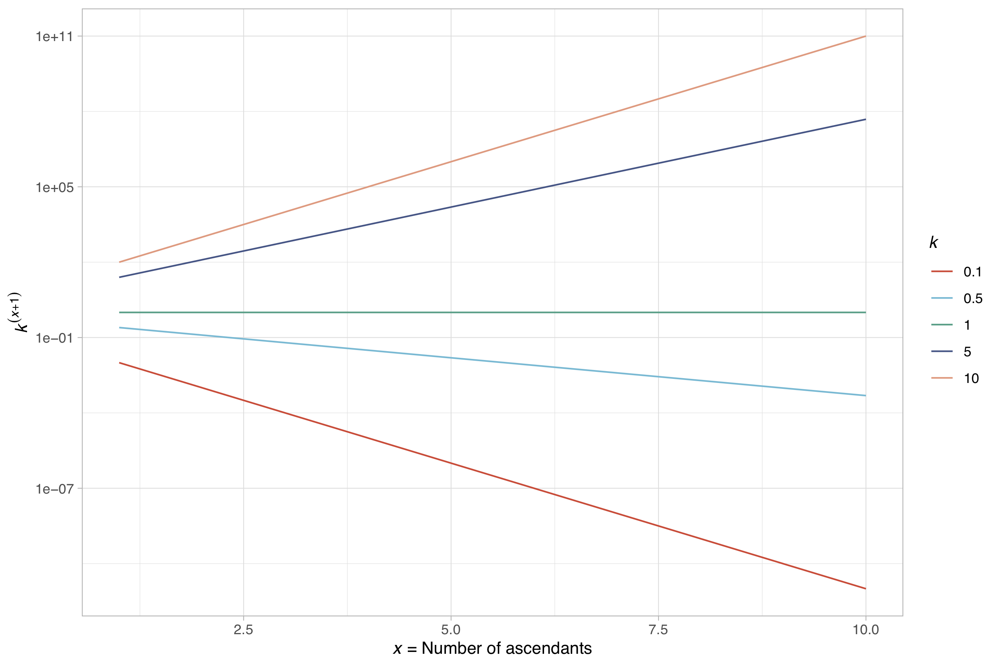
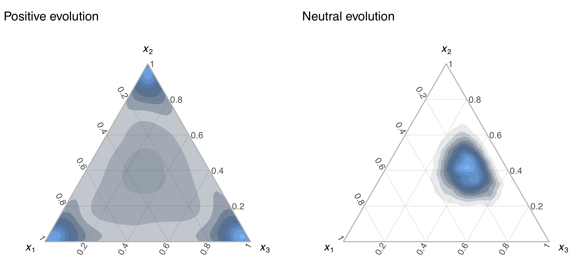
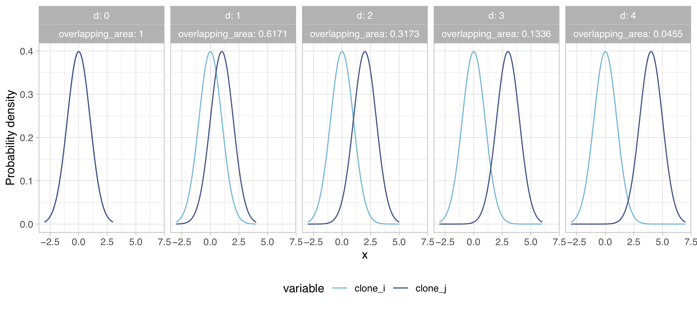
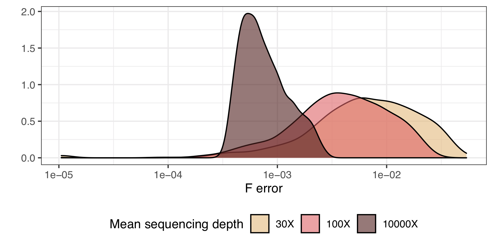
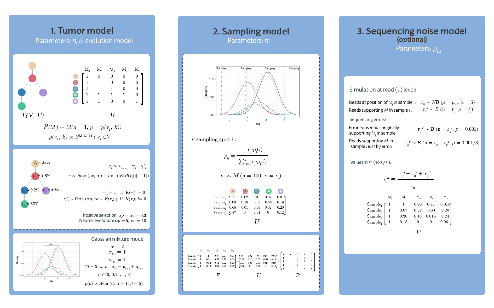

<style>
body {
text-align: justify}
</style>

<script type="text/x-mathjax-config">
MathJax.Hub.Config({
  TeX: { equationNumbers: { autoNumber: "AMS" } }
});
</script>

```{r setup, include = FALSE}
knitr::opts_chunk$set(
  collapse = TRUE,
  comment = "#>"
)
```

```{r, echo = FALSE, message = FALSE, warning = FALSE}
library(GeRnika)
library(ggpubr)
library(knitr)
set.seed(1)
```

`GeRnika` is an `R` package for the simulation of tumor clonal data and the visualization and comparison of tumor phylogenies. In this document we delve into the data simulation functionality, offering insights into how instances are generated.

## Overview of the data instances {#ov_inst}

Each instance simulated by `GeRnika` consists of 4 numerical matrices $\boldsymbol{F}$, $\boldsymbol{F_{true}}$, $\boldsymbol{U}$ and $\boldsymbol{B}$, that relate to each other so that:

\begin{equation}
\boldsymbol{F_{true}} = \boldsymbol{U} · \boldsymbol{B}
\end{equation}

This equation arises within the Variant Allele Frequency Factorization Problem (VAFFP) formulation of the Clonal Deconvolution and Evolution Problem (CDEP), and essentially states that the $n$ mutation frequencies in a series of $s$ tumor samples (matrix $\boldsymbol{F_{true}}$) are the result of the combination of the tumor clonal structure, represented by a tree (matrix $\boldsymbol{B}$), and the clone proportions captured in each sample (matrix $\boldsymbol{U}$). Specifically, these matrices are:

$\boldsymbol{F_{true}} \in [0, 1]^{s \times n}$ matrix: It is a matrix $s \times n$, and it contains the mutation frequency (VAF) values of the $n$ mutations present in $s$ tumor biopsies or samples. 

$\boldsymbol{B} \in \{0, 1\}^{n \times n}$ matrix: It is a binary square matrix of size $n$ where $b_{ij} = 1$ means that clone $i$ contains the mutation $j$. It represents the phylogeny of the tumor.

$\boldsymbol{U} \in [0, 1]^{s \times n}$ matrix: It is a matrix $s \times n$ where $u_{ij}$ is the fraction of clone $j$ in sample $i$.

Now, all this holds in a noise-free scenario. However, we do know that in real life there are many factors that make the VAF values noisy, which essentially means that the VAF values of the mutations do no longer exactly correspond to the sum of the sample fractions of all those clones that contain that mutation. In this `R` package we have only considered the noise added by DNA sequencing procedures to the VAF values and we have translated it into the $\boldsymbol{F} \in [0, 1]^{s \times n}$ matrix. Thus, we have that the product of the matrices $\boldsymbol{U}$ and $\boldsymbol{B}$ may not equal $\boldsymbol{F}$:

\begin{equation}
\boldsymbol{F} \neq \boldsymbol{U} · \boldsymbol{B}
\label{eq:F}
\end{equation}

The VAFFP formulation works under a few assumptions. The first one is that tumors have a monoclonal origin, i.e., they arise from a single abnormal cell that that at some point began to divide uncontrollably and founded the tumor. The second one is the infinite sites assumption (ISA), according to which a given mutation arises at most once over the course of evolution of the tumor, and mutations can not disappear. Any data generated using this package will adhere to those assumptions.

Importantly, even if the data simulation functionality in `GeRnika` was primarily devised for creating instances for the CDEP, the output or the byproducts of the data models on it can definitely be used in any other application in which this data may be useful. With this in mind, we have implemented the procedures in such a way that they are highly customizable by the user. We explain this usage throughout this document.

## Overview of the data parameters {#ov_param}

`GeRnika` allows the user to set parameters related to the evolution of a tumor, the sampling procedure and the data acquisition process, and include the number of clones in the tumor, number of biopsies taken from the tumor, evolution model, evolutionary tree topology and sequencing depth. More details can be found in the following sections.


## Basic instantiation {#basic_inst}

The general function to simulate an instance is `create_instance`. This function has the following parameters:

| Parameter        | Description                                                | Type |
| ---------------- | ---------------------------------------------------------- | ----------------- |
| `n`                | Number of mutations/clones ($n$).                                           |  Natural number |
| `m`                | Number of samples ($s$).                                          |  Natural number |
| `k`                | Topology parameter that controls for the linearity of the topology.                                    |  Positive rational number      |
| `selection`        | Evolution model followed by the tumor.     | Categorical: "positive" or "neutral" |
| `noisy`            | Add sequencing noise to the values in the $F$ matrix. | Boolean |
| `depth` | (only if `noisy` = `TRUE`) Average number of reads that map to the same locus, also known as sequencing depth.               |  Natural number |
| `seed` | Seed for the pseudo-random topology generator               |  Real number |

For instance, if we want to create a noise-free instance with 4 samples obtained from a tumor with 10 clones, evolving under neutral evolution and with a uniformly random topology, we can type the following:

```{r}
I1 <- create_instance(n = 10, m = 4, k = 1, selection = "neutral", noisy = FALSE, seed = 1)
I1
```

In this case, $\boldsymbol{F_{noisy}}$ equals $\boldsymbol{F_{true}}$.

If we instead want the instance to be noisy, we just need to adjust the `noisy`and `depth` parameters:

```{r}
I1 <- create_instance(n = 10, m = 4, k = 1, selection = "neutral", noisy = TRUE, 
                      depth = 100, seed = 2)
I1
```

This time, the matrices $\boldsymbol{F_{noisy}}$ and $\boldsymbol{F_{true}}$ are no longer the same.

## Advanced instantiation {#adv_inst}

The previous section describes how to generate instances in a straightforward and rapid manner. In this section, we provide an overview of the structure of `Gernika`'s data simulation functionality, offering insights into each component and explaining the functions that define the simulation process.

### Digging into the models {#models}

In order to simulate the $\boldsymbol{B}$ and $\boldsymbol{U}$ matrices, `Gernika` relies in two models: a tumor model that simulates the evolutionary history and current state of the tumor and a sampling model that represents the tumor sampling process. Once that these two matrices have been calculated, the matrix $\boldsymbol{F_{true}}$ is obtained by multiplying them. There is a last model which is a sequencing noise model that can optionally be used if noisy data is desired; this adds sequencing noise to the VAF values in the $\boldsymbol{F_{true}}$ matrix, producing the $\boldsymbol{F_{noisy}}$ matrix. We analyze each of these models in detail in the coming lines.

#### Tumor model {#tumor_model}

The tumor model generates a clonal tree $T$ and an associated matrix $\boldsymbol{B}$, together with the clone proportions $\boldsymbol{c}$ and tumor blend at the moment of sampling. Briefly, the clonal tree $T$ that represents the development of a tumor with a set of mutations $M$ so that |$M$| = $n$, is a rooted tree on an $n$-sized vertex set $V_n = \{v_{1}, \dots, v_{n} \}$ and an $n-1$-sized edge set $E_T = \{e_{ij} \}$, where $v_{i}$ corresponds to the vertex or clone $i$ and an edge $e_{ij}$ between two vertices $v_{i}$ and $v_{j}$ represents a direct ancestral relationship.

In the first place, an $n$-sized tree $T$ with a random topology is created in the following manner. First, the root node of $T$, $\mathcal R(T)$, is set and a random mutation $M_i \in M$ is assigned to it. Then, for each of the remaining $M_j \in M - \{M_i\}$ mutations, a new node $v_j$ is created; then the mutation $M_j$ is assigned to it and the node is attached as a child of an existing node in $T$. In order to meet the ISA model, each of the newly added nodes inherits all the mutations present in its parent node.

The attachment of nodes to the tree is not uniformly at random; instead, the nodes in the $T$ that is being built have different probabilities of being chosen as parent nodes for the new nodes, depending on the number of ascendants, $\mathcal A(v_i)$, they have. Mathematically speaking, $\forall M_j \neq \mathcal R(T)$, its parent node $\mathcal P(M_j)$ is sampled from $V_n$ following a multinomial distribution:

\begin{equation}
\mathcal P(M_j) \sim M(n = \textrm{1}, \boldsymbol{p} = \boldsymbol{p}(v_i, k)); v_i \in V_n
\label{eq:pk}
\end{equation}

where

\begin{equation}
\boldsymbol{p}(v_i, k) \propto k^{(|\mathcal A(v_i) | + 1)}; v_i \in V_T
\end{equation}

$k\in (0, +\infty)$ is the topology parameter that determines if the topology is more branched, with a decreasing probability for increasing numbers of ascendants ($k$ $<$ 1), or more linear, with an increasing probability for increasing numbers of ascendants ($k$ $>$ 1). At the same time, setting $k$ to 1 assigns equal probabilities to all the nodes and generates a completely random topology. The relationship between $k$ and the topology can graphically be seen in the following figure:


```{r fig.align = 'center', out.width = "60%", fig.cap = " Function that determines the frequency of selection of an existing node in the tree $T$ as the parent node of new children. The function is dependant on the number of ascendants and the topology parameter $k$.", echo = FALSE}

```

This procedure to obtain a tree $T$ and one of the possible $\boldsymbol{B}$ matrices associated to it is implemented in the function `create_B`. For instance, if we want to simulate a tumor with 10 clones with a rather linear topology, we could use the following code:

```{r}
n <- 10 
k <- 8

B_mat <- create_B(n, k)
B_mat
```

Once $\boldsymbol{B}$ is obtained, $\boldsymbol{c}$ \textit{at the moment of sampling} are simulated. We stress that these proportions $c_i$ refer to the moment of the sampling because, due to the dynamic nature of tumor growth and evolution, these proportions need not be the same at any two time instants. It is also worth mentioning here that these proportions are not the ones that show in the $\boldsymbol{U}$ matrix, which are the \textit{sampled} clone proportions, but the \textit{real} ones that do not depend on any sampling. 

These clone proportions $\boldsymbol{c}$ are calculated by sampling a Dirichlet distribution in each multifurcation of $T$. For instance, for a node $v_i$ with children $\mathcal K(v_i)$  = \{$v_j$, $v_k$\}, we draw one sample $\{x_i, x_j, x_k\}$ that represents the proportions of the parent clone and its two children from $Dir(\alpha_i, \alpha_j, \alpha_k)$, respectively. When this sampling is performed in an internal node of the tree, i.e., not in the root node, these proportions are scaled to the original proportion of the parent clone so that once all the multifurcations have been visited, the proportions of all the clones in $T$ sum up to one. 

The parameters of the Dirichlet distribution depend on the evolution model of the tumor. In `GeRnika` we consider two basic cases: positive selection-driven evolution or neutral evolution. According to positive selection-driven evolution, some mutations provide growth advantage whereas most of them do not, so the former clones get over other existing clones and take up the biggest part of the tumor. This results in tumors dominated by few clones, while the rest of clones are observed in minor proportions. Under neutral evolution, instead, there is not a significant number of mutations that provide fitness advantage and clones accumulate just out of tumor progression, so all clones are present in similar proportions

Based on this, the $\alpha$ parameters for the Dirichlet distribution for positive selection-driven evolution have been set to $\boldsymbol{\alpha}$ = 0.3, and for the neutral evolution to  $\alpha_{p}$ = 5 and $\boldsymbol{\alpha}_{c}$ = 10 . We use different alpha values for parent and children nodes in the neutral evolution so that clones that result from multiple multifurcations do not end up with smaller proportions just because of their position in the topology, ruining the expected clone proportion distribution for this type of evolution model. These values have been selected empirically and their effect is depicted in the following figure, which shows how 5,000 random samples from the mentioned Dirichlet distributions (for the particular case of 3 dimensions, i.e., one parent and two children nodes) would be distributed on a 2-simplex. As can be seen, for positive selection ($\boldsymbol{\alpha}$ = 0.3), the $\{x_i, x_j, x_k\}$ values are pushed towards the corners of the simplex ($\alpha_i$ is $<$ 1) in an uniform manner (all $\alpha_i$ are equal); in other words, the samples tend to be sparse; usually one component has a large value and the rest have values close to 0. Instead, when the neutral selection is adopted ($\boldsymbol{\alpha}$ = [5, 10, 10]), the values in $\{x_i, x_j, x_k\}$ concentrate close to the middle of the simplex (all $\alpha_i$ are $>$ 1) but tend to deviate to those components with larger $\alpha$. This means that samples $\{x_i, x_j, x_k\}$ are less sparse, with larger values for $x_2$ and $x_3$ in this case, which represent the children nodes.

```{r fig.align = 'center', out.width = "60%", fig.cap = " Ternary density plots of 5,000 samples drawn from two 3-dimensional Dirichlet distributions. The parameters of the Dirichlet distribution on the left are $\\boldsymbol{\\alpha}$ = 0.3 and the distribution is used to represent positive-driven evolution. The distribution on the right has parameters $\\boldsymbol{\\alpha}$ = [5, 10, 10] and it is used to represent neutral evolution.", echo = FALSE}

```

In short, we have that the proportion of the clone $v_i \in V_T | v_i \neq \mathcal R(T)$ in the tumor at the moment of sampling, given by $c_i$, follows this distribution:

\begin{equation}
    c_i \sim c_{\mathcal P(v_i)} \cdot \gamma_i \cdot \gamma_i^\prime
\end{equation}

where 

\begin{equation}
\gamma_i \sim Beta(\alpha_{c}, \alpha_{p} + \alpha_{c} \cdot (|\mathcal K(\mathcal P(v_i))| - 1))
\end{equation}

and

\begin{align}
\gamma_i^\prime = 1 \quad \text{if } |\mathcal K(v_i)| = 0 \\
\gamma_i^\prime \sim Beta(\alpha_{p}, \alpha_{c} \cdot |\mathcal K(v_i)|)  \quad \text{if } |\mathcal K(v_i)| \neq 0
\end{align}


In turn, if $v_i = \mathcal R(T)$:

\begin{equation}
c_i \sim Beta(\alpha_{p}, \alpha_{c} \cdot  |\mathcal K(v_i)|)
\end{equation}

The calculation of clone proportions is managed internally by the functions `.distribute_freqs` and `calc_clone_proportions`. The `.distribute_freqs` function samples the Dirichlet distribution for the node corresponding to the designated clone and scales the resulting values to the original proportion of the parent clone, unless the node represents the root clone. The `calc_clone_proportions` function oversees the calculation of clone proportions throughout the tree $T$, calling `.distribute_freqs` at each multifurcation to distribute proportions accordingly.

To finish with the tumor model, the tumor blend is simulated, i.e. how physically mixed are the clones between them. For doing so, we simplify the spatial distribution to one dimension and we model the tumor as a Gaussian mixture model of $n$ components, where each component $G_i$ represents a tumor clone and the mixture weights are given by $\boldsymbol{c}$. The variance for all components is set to 1, while their mean value is a random variable. Specifically, a random clone is selected in the first place and the mean value of its component is set to 0. Then, the mean values of the $n - 1$ remaining components are calculated in a sequential manner by summing $d$ units to the mean value of the immediately prior component. $d \in \{0, 0.1, \ldots,4\}$ follows a Multinomial distribution so that:

\begin{equation}
p(d) \propto Beta(d; \alpha=1, \beta=5)
\end{equation}

For $d$ = 0, the two clones are completely mixed; for $d$ = 4, they are physically far from each other. This upper limit for $d$ has been set empirically, after observing that with this value, the overlapping area between the two clones is already minimal, as shown in the figure below:

```{r fig.align = 'center', out.width = "80%", fig.cap = "Overlapping area of pairs of Gaussian probability density functions with $sd$=1 and mean differences ($d$) ranging between 0 and 4. The functions represent 1-dimensional projections of tumor clone masses.", echo = FALSE}

```

The tumor blend simulation is implemented internally in the `place_clones_space` function, which currently does not allow modification of the blending parameters. The values in the `mean_diffs` vector and the Beta distribution parameters ($\alpha$ = 1 and $\beta$ = 5) have been set to achieve a specific blending pattern, favoring smaller $d$ values to prevent excessive sparsity in the resulting samples. 


#### Sampling model {#sampling_model}

So far we have explained how the clones of a tumor are modeled by the tumor model. However, in real practice there is no easy way of observing these tumor global properties; instead, we only have the information that samples or biopsies can provide. This means, among many other things, that the real clone proportions $\boldsymbol{c}$ can not be obtained. Instead, we can only get the \textit{sampled} clone proportions, which depend on certain sampling procedure; most of the time, the sampled clone proportions will not match the real ones. These sampled clone proportions are, in fact, the $\boldsymbol{u}_{i.}$ elements in the matrix $\boldsymbol{U}$. 

The sampling model in `Gernika` models the physical sampling of the tumor and, at the same time, allow us build the $\boldsymbol{U}$ matrix of the problem. This model actuates over the data simulated with the tumor model; specifically, it simulates some sampling performed in a grid-manner over the tumor Gaussian mixture model described in the previous subsection. Let $G_i$ and $G_n$ be the components with the lowest and largest mean values, respectively.  Then, the domain is limited to $[\mu_{Gi} - 3 \cdot \sigma_{Gi}, \mu_{Gn} + 3 \cdot \sigma_{Gn}]$ with $\sigma_{Gi} = \sigma_{Gn} =$ 1, and it is divided into $m$+1 equal-sized bins by $m$ cutpoints that represent the sampling sites. The 1$^{st}$ and $m^{th}$ cutpoints are always set to $\mu_{Gi} - 3 \cdot \sigma_{Gi} + 20$ and $\mu_{Gn} + 3 \cdot \sigma_{Gn} - 20$, and the remaining $m$-2 cutpoints are calculated accordingly. 

The probability density of the components of the mixture model on those sites is normalized so that their sum sums up to 1 and the resulting values $\boldsymbol{p}_i$ are taken as the tumor clone composition values on the sampling spot $i$:


\begin{equation}
\forall i \quad p_{ij} = \frac{c_j \cdot p_j(i)}{\sum_{j = 1}^{n} c_j \cdot p_j(i)}
\label{eq:pij_2}
\end{equation}

Finally, the effect of the cell count on the samples is considered so that the final tumor clone composition values in each sample, i.e., $\boldsymbol{u}_{i.}$, are modeled using a multinomial distribution:

\begin{equation}
\boldsymbol{u}_{i.} \sim \frac{M(n = \textrm{100}, p = \boldsymbol{p}_i)}{100}
\end{equation}

The sampling model, along with the proportions of the clones in the tumor and the tumor blend described in the tumor model section, is implemented in the `create_U` function. Within this sampling model, the function sets parameters internally, including the sampling sites (`cutpoints_idx` and `cutpoints`) within the Gaussian mixture model domain $[\mu_{Gi} - 3 \cdot \sigma_{Gi}, \mu_{Gn} + 3 \cdot \sigma_{Gn}]$, and uses a user-defined number of sampled cells, $n_cells$, as the parameter in the multinomial distribution. 

To simulate and sample clone proportions from a $\boldsymbol{B}$ matrix and construct the $\boldsymbol{U}$ matrix, we can use the following code. In this example, we assume neutral evolution to simulate clone proportions and generate 6 samples, each with 100 cells:

```{r}
m <- 6  
selection <- "neutral"

U_mat <- create_U(B = B_mat, m = m, selection = selection, n_cells = 100)
U_mat
```

#### Sequencing noise model {#noise_model}

Up to this point, we have explained how the $\boldsymbol{B}$ and $\boldsymbol{U}$ matrices of an instance are simulated. In case we are simulating noise-free data, the instance is complete once Equation (1) has been applied on them in order to obtain both $\boldsymbol{F_{true}}$ and $\boldsymbol{F_{noisy}}$ matrices. In GeRnika, Equation (1) is encoded in the `create_F` function.

The `create_F` function, in addition to the two matrices to be multiplied, includes the boolean parameter `heterozygous`. This parameter determines whether to adjust the clone proportions for heterozygous states. If `heterozygous` is set to `TRUE`, the clone proportions are halved to reflect heterozygous states. Instead, if `heterozygous` is set to `FALSE`, the clone proportions remain unchanged. The function can be used as follows:

```{r}
F_mat <- create_F(U = U_mat, B = B_mat, heterozygous = FALSE)
```

As a brief reminder, each element $f_{t-ij}$ in $\boldsymbol{F_{true}}$ denotes the frequency or VAF of the mutation $M_j$ on sample $i$ or, in other words, the proportion of sequencing reads that harbour the mutation $M_j$ on that sample. This also means that 1 - $f_{t-ij}$ of the reads on that sample do not observe the mutation but the normal or reference nucleotide. 

As the user may know, there exist numerous factors that alter the VAF value in an artificial manner so that this value deviates from the real ratio between the mutation and the reference nucleotides, including the noise that is introduced by the DNA sequencing process itself. The ways noise is introduced in this process are mainly two: through an incorrect nucleotide read of a fragment due to limitations of the sequencing instrument (e.g., a position that contains an A is read as a T) and through the production of a biased number of reads for a site that arises due to chemical reaction particularities or simply because not all the fragments get to be sequenced. This limitation can however be mitigated up to a certain level, as it has been shown that the higher the depth of coverage ($\mu_{sd}$), i.e., the average number of reads that cover each position, the most accurate is the VAF value. In order to account for the effect of such noise in the data instances, we have designed a sequencing noise model. This model adds noise to the $\boldsymbol{F_{true}}$ matrix and builds a noisy $\boldsymbol{F_{noisy}}$ matrix, so that $\boldsymbol{F_{noisy}} \neq \boldsymbol{U} · \boldsymbol{B}$. Specifically, the model simulates the noise at the level of the sequencing reads and then recalculates the new $f_{n-ij}$ values, as follows.

The sequencing depth $r$ at the genomic position where $M_j$ occurs in sample $i$ is distributed as a negative binomial distribution so that:
\begin{equation}
r_{ij} \sim NB(\mu = \mu_{sd}, \alpha = 5)
\end{equation}


The number of reads supporting the alternate allele $r^{a}_{ij}$ is modeled by a binomial distribution:
\begin{equation}
r^{a}_{ij} \sim B(n = r_{ij}, p = f_{t-ij})
\label{eq:ra}
\end{equation}

The use of probability distributions for sampling the sequencing depth and the number of reads instead of using fixed values is the manner in which stochasticity is introduced in the read numbers and thus in the $f_{n-ij}$ values. 

Illumina mismatch errors are known to be around 0.1\%. For simulating its effect on the VAF values, the number of reads $r^{a\prime}_{ij}$ that, despite originally supporting the alternate allele, contain a different allele as a result of a sequencing error are simulated as:

\begin{equation}
r^{a\prime}_{ij} \sim B(n = r^{a}_{ij}, p = 0.001)
\end{equation}


We also need to consider the situation where the reads contain the reference nucleotide but are read with the alternate allele as a result of this error. This is better understood with an example. Let us imagine that there is one genomic position where the normal cells have a T but in some cells there is a mutation and the T has changed to an A. For the normal cells, with probability 0.1$\%$ a sequencing error will occur and instead of a T, one of C, G or A will be read, all with equal chance. Thus, $\frac{0.001}{3}$\% of the time, reads with the mutation of interest will arise from normal reads:

\begin{equation}
r^{r\prime}_{ij} \sim B(n = r_{ij} - r^{a}_{ij}, p = \frac{0.001}{3})
\end{equation}


Thus, taking all these into consideration, the final noisy VAF values $f_{n-ij}$ are simulated as: 

\begin{equation}
f_{n-ij} = \frac{r^{a}_{ij} - r^{a\prime}_{ij} + r^{r\prime}_{ij}}{r_{ij}}
\end{equation}


In the following figure we have depicted for a collection of noisy instances, the density of the mean absolute error between the $\boldsymbol{F_{noisy}}$ and its corresponding noise-free $\boldsymbol{F_{true}}$ matrix. As it can be seen, the higher $\mu_{sd}$, the lower the error we introduce to the $\boldsymbol{F_{noisy}}$ matrix. This is an expected behaviour since $r^{a}_{ij}$ values follow a binomial distribution (Equation 14) where the number of trials is conditioned by $\mu_{sd}$ (Equation 13) and the event probability is the $f_{ij}$ value.

```{r fig.align = 'center', out.width = "65%", fig.cap = "Density of the mean absolute error in noisy $F$ matrices for different $\\mu_{sd}$ values that correspond to different noise levels.", echo = FALSE}

```

The addition of sequencing noise to the data is controlled by the boolean `noisy` parameter in the general instantiation `create_instance` function. Essentially, when this parameter is set to `TRUE`, the `add_noise` function is called, which is who actually manages the addition of noise to the matrix $\boldsymbol{F_{true}}$. The `create_instance` function also includes the `depth` parameter, which quantifies the amount of noise introduced. As explained in the previous paragraph, noise increases as `depth` values decrease. The default value for this parameter is 30 (30X); this value was chosen as most whole genome sequencing (WGS) data is sequenced at this depth. However, users may choose any other value that meets their needs.

The negative binomial distribution is a distribution commonly used to model sequencing depth. In such context, the mean of the distribution $\mu$ represents the expected number of reads for a position, whereas the overdispersion parameter $\alpha$ controls the degree of variability in the number of reads across different samples from the distribution. This parameter can therefore be used to control the level of noise in the data. Increasing $\alpha$ will widen the range of values sampled from the distribution, resulting in some samples with much higher or lower depth than the mean sequencing depth, thereby increasing noise in the data. Conversely, decreasing $\alpha$ will reduce variability across samples, leading to more consistent sequencing depth values and, thus, less noisy data. 

The $\alpha$ parameter is encoded as `overdispersion` within the functions in GeRnika. The `create_instance` function does not include this parameter, but it is available in the `add_noise` function. Users who wish to modify it will need to first create a noise-free $\boldsymbol{F}$ matrix (either by using the sequence of `create_B`, `create_U`, and `create_F`, or by extracting `F_true` from the result of calling `create_instance`). They can then cal `add_noise` on that $\boldsymbol{F}$ matrix, where the value of the overdispersion parameter can be adjusted as described above.


We would like to make two final notes regarding the sequencing noise model. The first one is that, even if our simulated data procedure follows the ISA, it is possible that due to the process of adding noise, resulting data breaks this assumption. The second one is a reminder that the sequencing noise model is an optional model only to be used if noisy data is to be generated. 

### Summary 

To close up, the following figure provides a graphical summary of the whole process and illustrates an example:

```{r fig.align = 'center', out.width = "100%", fig.cap = "Graphical summary of the models for building synthetic datasets for the CDEP problem, accompanied by an example. The simulation builds upon two core models and a third one which is optional. The tumor model first simulates a clonal tree $T$ (and an associated $\\boldsymbol{B}$ matrix) of $n$ nodes; this is done in an iterative manner and as a function of the parameter $k$, which controls for the linearity of the topology; when $k <$ 1, clones up in the tree are favoured over those deep in the topology for being the parents of the newly added nodes and when $k >$ 1, the deep ones are favoured over the others (Equation XX). In this example, $k$ was set to 0, which leads to a random topology. After that, we simulate the proportions of the clones in the tumor at the moment of sampling ($\\boldsymbol{c}$). For calculating them, a Dirichlet distribution is sampled in each multifurcation of $T$ and then the resulting values are scaled to the original proportion of the parent clone, so that at the end this results in all the values or proportions summing up to one. The proportion distribution is dependant on the evolution model we assume for the tumor (positive selection or neutral evolution) and this is controlled by using different sets of $\\alpha$ values in the Dirichlet distributions. As a result of the proportions being (scaled) samples from Dirichlet distributions, we have that each clone proportion $c_i$ follows the distributions shown in this figure. In this example we opted for a neutrally evolving tumor, which resulted in the $\\boldsymbol{c}$ values that have been overlaid over each clone in $T$. The last step in the tumor model is to simulate the tumor blend, which is modelled by a Gaussian mixture model of $n$ components, where each component represents a tumor clone. The distance between two successive components or clones $d \\in \\{0, 0.1, \\ldots,4\\}$ follows a Multinomial distribution where the probabilities are proportional to the density function of a Beta distribution. Thus, for small $d$ values, two clones are completely mixed, whereas for values clones to 4, they are physically far from each other. The sampling model draws $m$ samples from the Gaussian mixture model just described. These sampling sites correspond to the $m$ cutpoints that divide the domain of the model into $m +$ 1 equal-sized bins. In this example, we have got 4 samples. The probability density of the components of the mixture model on those sites is normalized so that their sum sums up to 1 and the resulting values are used as the probability values of a Multinomial distribution that is used to calculate the final values in the matrix $\\boldsymbol{U}$. Once we have got the $\\boldsymbol{U}$ and $\\boldsymbol{B}$ matrices, we can calculate the $\\boldsymbol{F}$ matrix using Equation \ref{eq:F}. Finally, we can optionally add noise that simulates sequencing noise to this newly created $\\boldsymbol{F}$ matrix and create a new noisy $\\boldsymbol{F}^n$ matrix. This model simulates noise at the level of the sequencing reads by sampling various distributions that simulate the total number of reads at the site, the number of reads that support each of the mutations and mismatch errors, and it then recalculates the new $f_{ij}^n$ values based on them.", echo = FALSE}

```
